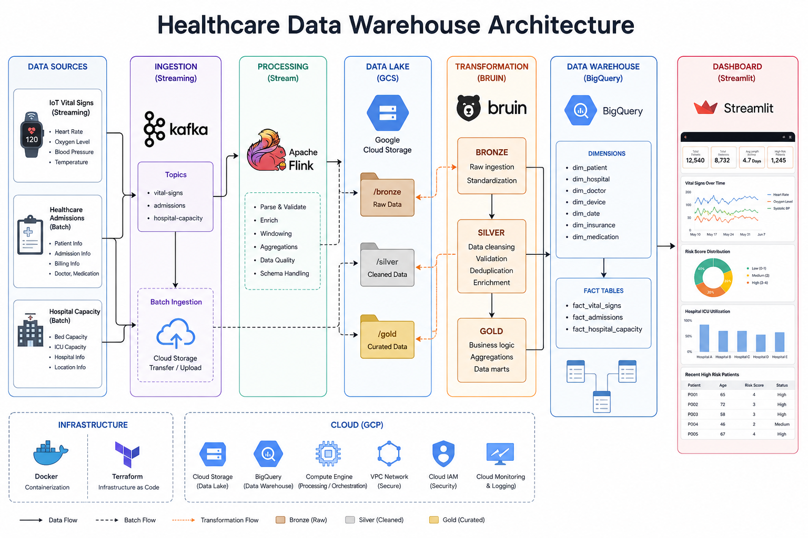
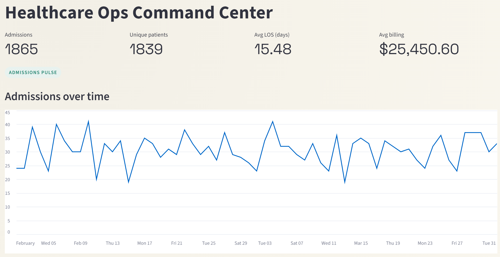
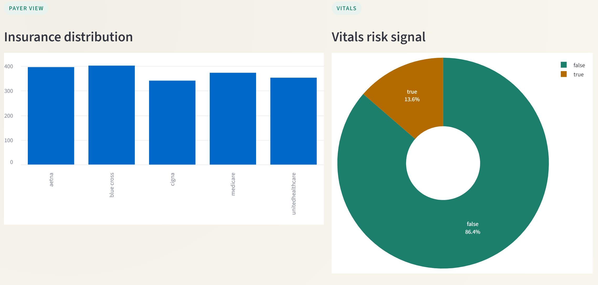

# Healthcare Data Warehouse Pipeline

## 1. Project Title and Description
This project builds an end-to-end data engineering pipeline for healthcare operations analytics. The goal is to unify batch and streaming data into a clean, queryable warehouse and deliver actionable insights through a dashboard.

Business problem:
- Hospital operators need timely visibility into admissions, capacity, and vitals risk signals.
- Data arrives as a mix of batch CSV extracts and streaming device events.

Solution:
- Ingest batch and streaming data into a data lake.
- Process and curate the data into a Bronze-Silver-Gold lakehouse pattern.
- Model a star schema in BigQuery.
- Power a Streamlit dashboard for operational analytics.

## 2. Architecture Overview
The pipeline supports both batch and streaming data paths and converges in BigQuery for analytics.



## 3. Tech Stack
Infrastructure
- GCP: Cloud platform for storage and analytics.
- Terraform: Infrastructure as code for GCP resources.
- Docker: Local development and service orchestration.

Processing
- Kafka/Redpanda: Streaming ingestion.
- PyFlink: Stream processing.
- Bruin: SQL-based transformations with data quality checks.

Storage
- GCS: Data lake for raw and processed data.
- BigQuery: Data warehouse for analytics.

Visualization
- Streamlit: BI dashboard for insights.

## 4. Data Sources
Batch datasets (CSV)
- Patients
- Healthcare admissions
- Hospital capacity

Streaming dataset
- Vitals events from devices (ingested via Kafka or Redpanda and processed with PyFlink)


## 5. Data Pipeline
1. Ingestion
	 - Batch CSV files loaded into GCS and BigQuery Bronze.
	 - Streaming vitals published to Kafka or Redpanda, processed by PyFlink, and landed in GCS.
2. Data Lake
	 - Raw and processed datasets stored in GCS.
3. Processing
	 - PyFlink handles streaming vitals transformations.
4. Transformation
	 - Bruin models clean and standardize data in Silver.
	 - Gold layer builds a star schema for analytics.
5. Warehouse
	 - BigQuery hosts Bronze, Silver, and Gold datasets.

## 6. Data Modeling
Star schema in the Gold layer:

Dimensions
- dim_patient
- dim_hospital
- dim_insurance

Facts
- fact_admissions (one row per admission)
- fact_hospital_capacity (one row per hospital per week)
- fact_vital_signs (one row per vitals event)

Keys and relationships
- Fact tables reference dimension keys for patient, hospital, and insurance.
- Surrogate keys are deterministic in dimension tables; facts use stable keys from upstream where appropriate.

## 7. Dashboard
The Streamlit dashboard highlights:
- Admissions volume and patient counts
- Average length of stay and billing
- Insurance distribution
- Vitals alert_flag distribution




## 8. How to Run the Project
Prerequisites
- Python 3.12
- Docker and Docker Compose
- Terraform
- GCP credentials in .google/credentials/google_credentials.json

Setup
```bash
git clone <repo-url>
cd project-de-zoomcamp
uv sync
```

Infrastructure
```bash
make terraform-init
make terraform-apply
```

Data Streaming
```bash
make docker-build
make docker-up
make producer
make flink-submit
```

Pipeline
```bash
bruin validate pipeline --fast
make bruin-pipeline
```

Dashboard
```bash
make dashboard
```

## 9. Project Structure
```
project-de-zoomcamp/
├── dashboard/
│   └── app.py
├── data/
├── data-streaming/
│   ├── job/
│   └── producers/
├── pipeline/
│   ├── assets/
│   │   ├── bronze/
│   │   ├── silver/
│   │   └── gold/
│   └── pipeline.yml
├── terraform/
├── docker-compose.yaml
├── Makefile
└── README.md
```

## 10. Challenges and Learnings
- GCS connector configuration: resolved by using the correct GCS connector jar and auth settings.
- BigQuery location mismatch: aligned dataset locations and ensured consistent project settings.
- Streaming offsets and schema drift: added validation and consistent typing in the Silver layer.

## 11. Future Improvements
- Add data quality dashboards and SLA monitoring.
- Introduce real-time alerting for vitals anomalies.
- Add ML models for risk prediction.
- Improve incremental processing and partitioning strategies.

## 12. Credits
Built following the DataTalksClub Data Engineering Zoomcamp standards.
